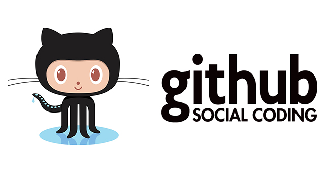

## Iniciamos la configuración
Vamos a empezar configurando varias variables necesarias para trabajar un poco más cómodo:
```
git config --global user.email          "corre@example.com"
git config --global user.name           "Tu nombre y apellidos"
git config --global init.defaultBranch  main
```

## Creamos un directorio

```
mkdir prueba
cd prueba
```

## Comprobamos que tenemos el directorio vacío

```
ls -la
```

## Inicializamos el repositorio

```
git init
```

## Comprobamos que se ha creado el directorio .git

```
ls -la
```

## Creamos un archivo README.md y ponemos nuestro nombre
Este archivo será el que se leera por defecto en GitHub
```
echo "Mi nombre" > README.md
```

## Registramos los cambios en el repositorio
1. Añadimos el área de preparación
```
git add README.md
```
1. Añadimos al repositorio en local
```
git commit -m "Primer cambio registrado"
```

## Añadimos dos líneas más
Cada vez que se añada una línea tenemos que hacer un commit cambiando la información

## Por último vemos cambios realizados

Para ello ejecutamos

```
git  log
git  log  --oneline
```

Deberían aparecer 3 commits


# Revisar commits realizados

En la actividad siguiente, haremos uso del comando **git checkout** para movernos por los distintos commits .

Antes de nada comprueba que tienes al menos 3 commits realizados. Para ello ejecuta:

```
git  log  --oneline --all
```

La opción --oneline, nos muestra la información de cada commit en una línea.

La opción --all, nos muestra todos los commits.

La primera columna es un **hash**, un identificador.

Los números no están ordenados. En mi caso, el primer commit tiene un hash 8b670f6. El último commit mio es el fedb39f. 
Tú tendrás otro hash distinto. No te preocupes, es así.

La segunda columna es el mensaje que pusimos cuando hicimos el commit.

Fíjate también que en el último commit, en mi caso fedb39f, existe un **identificador HEAD**. 
Ésta es una referencia que apunta al commit en el que estamos situados en el momento actual. 
Además aparece otro **identificador master**, que indica en la rama en la que estamos. Por defecto, siempre es master.

**El identificador master siempre apunta al último commit de la rama**. 
Sin embargo el identificador HEAD podemos moverlo y desplazarmos entre distintos commit y ver como estaban los archivos en cada momento. 

Para mover el identificador HEAD utilizamos el comando **git checkout**  *numero_hash*.

Realiza los siguientes pasos y crea las capturas correspondientes:

## 1. Vamos a ver el contenido del archivo README.md en el commit actual. 

Para ello hacemos:

```
cat  README.md
```

Deben aparecer 3 líneas de texto: tu nombre, la fecha y el nombre de AXúquer.

## 2. Vamos a movernos al primer commit. 

Para ello hacemos:

```
git  checkout  8b670f6
```

Tú deberás poner el hash que tengas.

Te aparecerá un mensaje que contiene "Te encuentras en estado 'detached HEAD'". Esto indica que la referencia HEAD no está al final de la rama. No te preocupes por ello.

Ahora veamos el contenido del archivo README.md.

```
cat README.md
```

Debe aparecer sólo una línea con tu nombre. Es el contenido que tenía dicho archivo en ese commit.

## 3. Veamos en que posición de la rama nos encontramos. Para ello ejecutamos:

```
git  log  --oneline --all
```

Fíjate donde apunta la referencia HEAD en este momento. 

Algo que quizás te haya pasado desapercibido pero que es extremadamente IMPORTANTE es que cada vez que nos movemos de un commit a otro, el contenido del directorio de trabajo cambia. Esto lo hace git de forma automática.

NO REALIZAREMOS ningún cambio a los archivos, sólo vamos a echar un vistazo.

## 4. Vamos a movernos al segundo commit. 

Para ello hacemos:

```
git  checkout  c578
```

Tú deberás poner el hash que tengas. No es necesario poner todos los dígitos, podemos acortar el hash. 

Ejecuta

```
cat README.md
```

y haz una captura de pantalla.

Deberían aparecer 2 líneas: tu nombre y la fecha.

## 5. Vuelve a hacer

```
git  log  --oneline --all
```

Y comprueba que HEAD está en el segundo commit.

## 6. Por último, 

para volver al último commit de la rama master, simplemente hacemos:

```
git  checkout master
```

Podemos ver que todo está en su sitio haciendo

```
git  log  --oneline --all
```

Haz una captura de pantalla.

> *NOTA: No borrar el repositorio local. Lo volveremos a utilizar en la siguiente actividad.*

# Etiquetar commits y ver diferencias

En esta actividad vamos a ver 3 comandos:

- **git tag**
- **git show** 
- **git diff**

El primer comando (**git tag**) nos permite poner etiquetas a los commits.  **No se etiquetan todos los commits, solo las releases que deseemos**.

Los 2 siguientes (**git show** y **git diff**) son para ver los cambios realizados entre distintos commits. Son muy parecidos aunque con pequeñas diferencias.

**Básicamente git show nos permite ver los cambios de un commit respecto al anterior, mientras que git diff nos permite ver cambios en un rango de commits**.

De todas formas tanto git show como git diff tienen tantas opciones que aquí sólo nos centraremos en las esenciales.

Empecemos:

## 1. Etiquetamos el commit primero y el tercero.

El primer commit será la versión 1 de nuestro proyecto. La etiqueta será v1.

El tercer commit será la versión 2 de nuestro proyecto. La etiqueta será v2.

El segundo commit no será etiquetado.

Para etiquetar utilizamos el comando

```
git  tag  -a  nombre_etiqueta  -m  "Mensaje"   commit_a_etiquetar
```

Por ejemplo, en mi caso:

```
git tag  -a v1  -m "Versión 1"  8b67
git tag  -a v2  -m "Versión 2"  fdeb
```

La opción -a significa annotate.

La opción -m nos permite poner un mensaje.

Finalmente debemos poner el commit al que deseamos aplicar la etiqueta.

Si por cualquier motivo nos equivocamos al crear la etiqueta podemos eliminarla con

```
git tag -d nombre_etiqueta
```

## 2. Usando etiquetas para movernos

Las etiquetas nos permiten referenciar commits de una forma más cómoda que usando el identificador de hash.

Por ejemplo es más cómodo usar:

```
git checkout v1
```

Que usar:

```
git checkout 8b67
```

Para volver al último commit haz:

```
git checkout master
```

## 3. Examinado cambios de un commit respecto al anterior.

Para ver los cambios introducidos respecto al commit anterior hacemos:

```
git show
```

En este caso, al coincidir todos los apuntadores  (HEAD, master, v2 y fdeb) al mismo sitio, el comando anterior es equivalente a:

```
git show HEAD
git show master
git show fdeb
git show v2
```

Como podemos observar, se añadió una línea, la que contiene AXúquer.

**Las líneas añadidas aparecen en verde y con un signo +**.

**Las líneas eliminadas aparecen en rojo y con un signo -**.

En este caso solo hemos realizado operaciones de adicción.

Para ver el cambio realizado en el commit segundo respecto al primero, hacemos

```
git show c578
```

Debe aparecer añadida la línea con la fecha.

Y para ver el cambio realizado en el commit primero respecto al repositorio vacío, hacemos:

```
git show v1
```

Debe aparecer añadida la línea con el nombre.

## 4. Examinado cambios de un commit respecto a varios anteriores.

Si deseamos ver todos los cambios realizados a lo largo de varios commits, haremos uso de git diff.

La forma de uso es 

```
git  diff  commit1..commit2
```

Por ejemplo, para ver los cambios entre la versión 1 y la versión 2, hacemos

```
git  diff  v1..v2
```

Podemos ver que se han añadido 2 líneas desde el commit v1.

Es muy aconsejable poner primero el commit más antiguo y después el commit más moderno. Si lo hacemos al contrario, el resultado en lugar de aparecer en color verde aparecerá en color rojo, y su interpretación será más confusa.

## 5. Diferencia entre git show y git diff

También podemos hacer

```
git show v1..v2
```

> *NOTA: No borrar el repositorio local. Lo volveremos a utilizar en la siguiente actividad.*
