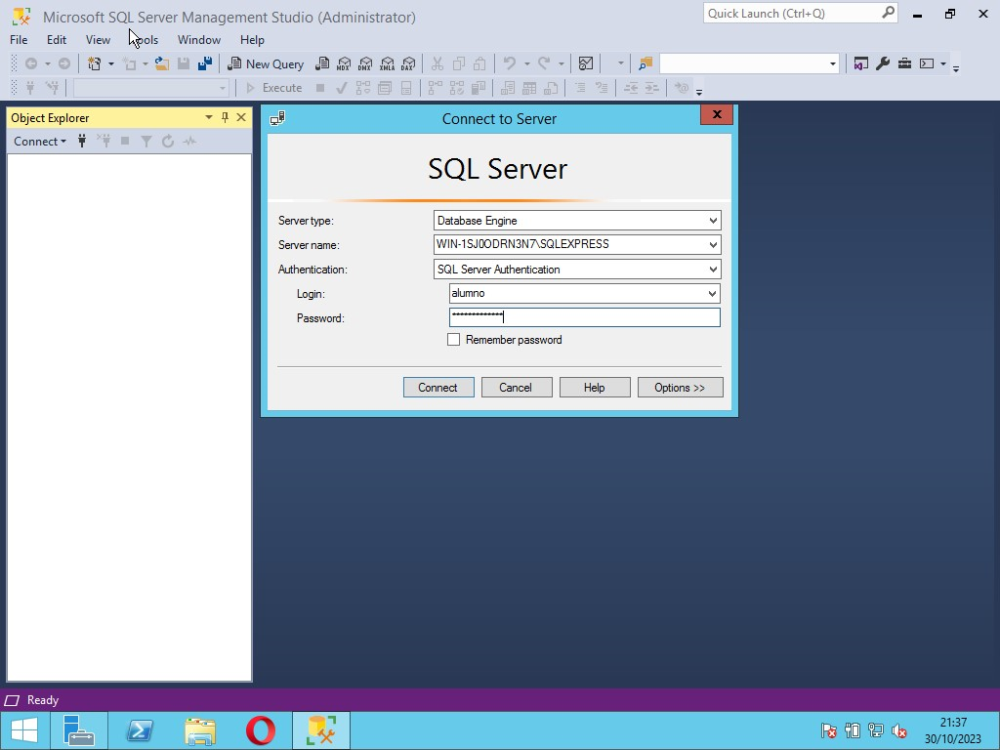
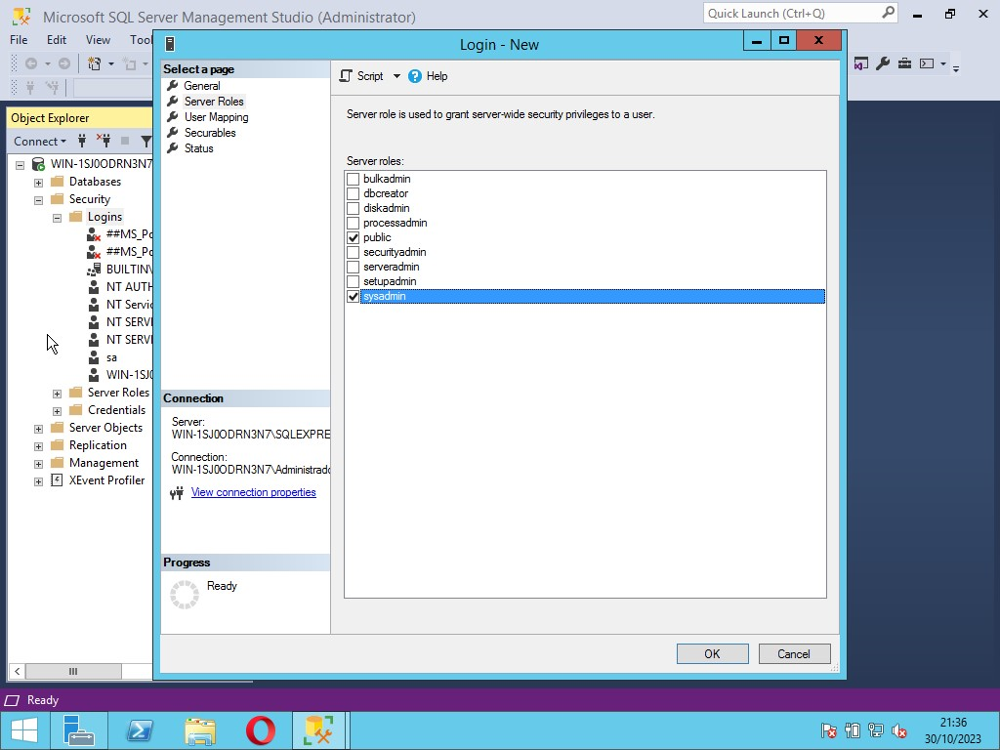

# Capa de red

Explique cómo los routers utilizan los protocolos y los servicios de capa de red para habilitar la conectividad integral.

Leyenda de la tabla
| Título del tema | Objetivo del tema |
| --- | --- |
| Características de la capa de red | Explique cómo la capa de red utiliza los protocolos IP para una confiabilidad de comunicaciones. |
| Paquete IPv4 | Explique la función de los principales campos de encabezado en el paquete IPv4. |
| Paquete IPv6 | Explique la función de los principales campos de encabezado en el paquete IPv6. |
| Cómo arma las rutas un host | Explique cómo los dispositivos de red usan tablas de enrutamiento para dirigir paquetes a un red de destino. |
| Tablas de enrutamiento de router | Explique la función de los campos en la tabla de enrutamiento de un router. |

## Características de la capa de red

### La capa de red

La capa de red, o Capa OSI 3, proporciona servicios para permitir que los dispositivos finales intercambien datos a través de redes. Como se muestra en la figura, IP versión 4 (IPv4) e IP versión 6 (IPv6) son los principales protocolos de comunicación de la capa de red. Otros protocolos de capa de red incluyen protocolos de enrutamiento como Open Shortest Path First (OSPF) y protocolos de mensajería como Internet Control Message Protocol (ICMP).

### Protocolos de capa de red

Para lograr comunicaciones end-to-end a través de los límites de la red, los protocolos de capa de red realizan cuatro operaciones básicas:

Direccionamiento de dispositivos finales : los dispositivos finales deben configurarse con una dirección IP única para la identificación en la red.
Encapsulación: La capa de red encapsula la unidad de datos de protocolo (PDU) de la capa de transporte en un paquete. El proceso de encapsulamiento agrega información de encabezado IP, como la dirección IP de los hosts de origen (emisores) y de destino (receptores). El proceso de encapsulación lo realiza el origen del paquete IP.
Enrutamiento: La capa de red proporciona servicios para dirigir los paquetes a un host de destino en otra red. Para transferir un paquete a otras redes, debe procesarlo un router. La función del router es seleccionar la mejor ruta y dirigir los paquetes al host de destino en un proceso que se denomina "enrutamiento". Un paquete puede cruzar muchos routers antes de llegar al host de destino. Se denomina "salto" a cada router que cruza un paquete antes de alcanzar el host de destino.
Desencapsulación: Cuando el paquete llega a la capa de red del host de destino, el host verifica el encabezado IP del paquete. Si la dirección IP de destino dentro del encabezado coincide con su propia dirección IP, se elimina el encabezado IP del paquete. Una vez que la capa de red desencapsula el paquete, la PDU de capa 4 que se obtiene se transfiere al servicio apropiado en la capa de transporte. El proceso de desencapsulación lo realiza el host de destino del paquete IP.
A diferencia de la capa de transporte (Capa OSI 4), que gestiona el transporte de datos entre los procesos que se ejecutan en cada host, los protocolos de comunicación de la capa de red (es decir, IPv4 e IPv6) especifican la estructura de paquetes y el procesamiento utilizado para transportar los datos de un host a otro host. La capa de red puede transportar paquetes de varios tipos de comunicación entre varios hosts porque funciona sin tener en cuenta los datos que contiene cada paquete.

## Encapsulación IP

IP encapsula el segmento de la capa de transporte (la capa justo por encima de la capa de red) u otros datos agregando un encabezado IP. El encabezado IP se usa para entregar el paquete al host de destino.

La figura ilustra cómo la PDU de la capa de transporte es encapsulada por la PDU de la capa de red para crear un paquete IP.

El proceso de encapsulamiento de datos capa por capa permite que se desarrollen y se escalen los servicios en las diferentes capas sin afectar a las otras capas. Esto significa que IPv4 o IPv6 o cualquier protocolo nuevo que se desarrolle en el futuro puede armar sin inconvenientes un paquete con los segmentos de capa de transporte.

El encabezado IP es examinado por dispositivos de Capa 3 (es decir, routers y switches de Capa 3) a medida que viaja a través de una red a su destino. Es importante tener en cuenta que la información de direccionamiento IP permanece igual desde el momento en que el paquete sale del host de origen hasta que llega al host de destino, excepto cuando se traduce por el dispositivo que realiza la traducción de direcciones de red (NAT) para IPv4.

Nota: NAT se discute en módulos posteriores.

Los routers implementan protocolos de enrutamiento para enrutar paquetes entre redes. El enrutamiento realizado por estos dispositivos intermediarios examina el direccionamiento de la capa de red en el encabezado del paquete. En todos los casos, la porción de datos del paquete, es decir, la PDU de la capa de transporte encapsulada u otros datos, permanece sin cambios durante los procesos de la capa de red.

### Características de IP

IP se diseñó como un protocolo con sobrecarga baja. Provee solo las funciones necesarias para enviar un paquete de un origen a un destino a través de un sistema interconectado de redes. El protocolo no fue diseñado para rastrear ni administrar el flujo de paquetes. Estas funciones, si es necesario, están a cargo de otros protocolos en otras capas, principalmente TCP en la capa 4.

Estas son las características básicas de la IP:

Sin conexión: - no hay conexión con el destino establecido antes de enviar paquetes de datos.
Mejor esfuerzo: - la IP es inherentemente poco confiable porque no se garantiza la entrega de paquetes.
Medios independientes: - Medios independientes: la operación es independiente del medio (es decir, cobre, fibra óptica o inalámbrico) que transporta los datos.

## Sin conexión

Sin conexión - Analogía

IP no tiene conexión, lo que significa que IP no crea una conexión de extremo a extremo dedicada antes de enviar los datos. La comunicación sin conexión es conceptualmente similar a enviar una carta a alguien sin notificar al destinatario por adelantado. La figura resume este punto clave.

Las comunicaciones de datos sin conexión funcionan con el mismo principio. Como se muestra en la figura, IP no requiere un intercambio inicial de información de control para establecer una conexión de extremo a extremo antes de que se reenvíen los paquetes.

Sin conexión: red

## Mejor esfuerzo

La IP tampoco necesita campos adicionales en el encabezado para mantener una conexión establecida. Este proceso reduce en gran medida la sobrecarga del protocolo IP. Sin embargo, sin una conexión completa preestablecida, los remitentes no saben si los dispositivos de destino están presentes y en funcionamiento cuando envían paquetes, ni tampoco si el destinatario recibe el paquete o si puede acceder al paquete y leerlo.

El protocolo IP no garantiza que todos los paquetes que se envían, de hecho, se reciban. En la ilustración, se muestran las características de entrega de mejor esfuerzo o poco confiable del protocolo IP.

## Independiente de los medios

Que sea poco confiable significa que IP no tiene la funcionalidad para administrar o recuperar paquetes no recibidos o dañados. Esto se debe a que, si bien los paquetes IP se envían con información sobre la ubicación de la entrega, no contienen información que pueda procesarse para informar al remitente si la entrega fue exitosa. Es posible que los paquetes lleguen dañados o fuera de secuencia al destino o que no lleguen en absoluto. IP no tiene la funcionalidad de retransmitir paquetes si se producen errores.

Las aplicaciones que utilizan los datos o los servicios de capas superiores deben solucionar problemas como el envío de paquetes fuera de orden o la pérdida de paquetes. Esta característica permite que IP funcione de manera muy eficaz. En el conjunto de protocolos TCP / IP, la confiabilidad es la función del protocolo TCP en la capa de transporte.

IP funciona independientemente de los medios que transportan los datos en las capas más bajas de la pila de protocolos. Como se muestra en la ilustración, los paquetes IP pueden ser señales electrónicas que se transmiten por cables de cobre, señales ópticas que se transmiten por fibra óptica o señales de radio inalámbricas.

La capa de enlace de datos OSI es responsable de tomar un paquete IP y prepararlo para la transmisión a través del medio de comunicación. Esto significa que la entrega de paquetes IP no se limita a ningún medio en particular.

Sin embargo, la capa de red tiene en cuenta una de las características más importantes del medio, que es el tamaño máximo de PDU que cada medio puede transportar. Esta característica se conoce como "unidad de transmisión máxima" (MTU). Parte del control de la comunicación entre la capa de enlace de datos y la capa de red consiste en establecer el tamaño máximo del paquete. La capa de enlace de datos pasa el valor de MTU a la capa de red. La capa de red luego determina qué tamaño pueden tener los paquetes.

En algunos casos, un dispositivo intermedio, generalmente un router, debe dividir un paquete IPv4 cuando lo reenvía de un medio a otro con una MTU más pequeña. Este proceso se denomina “fragmentación de paquetes” o “fragmentación”. La fragmentación provoca latencia. El router no puede fragmentar los paquetes IPv6.

## Paquete IPv4
### Encabezado de paquetes IPv4

IPv4 es uno de los protocolos de comunicación de la capa de red principal. El encabezado del paquete IPv4 se utiliza para garantizar que este paquete se entrega en su siguiente parada en el camino a su dispositivo final de destino.

El encabezado de paquetes IPv4 consta de campos que contienen información importante sobre el paquete. Estos campos tienen números binarios que examinan el proceso de capa 3.

## Campos de encabezado de paquete IPv4

Los valores binarios de cada campo identifican diversos parámetros de configuración del paquete IP. Los diagramas de encabezado del protocolo, que se leen de izquierda a derecha y de arriba hacia abajo, proporcionan una representación visual de consulta al analizar los campos de protocolo. El diagrama de encabezado del protocolo IP en la ilustración identifica los campos de un paquete IPv4.

Los dos campos a los que se hace más referencia son los de dirección IP de origen y de destino En estos campos, se identifica de dónde viene el paquete y a dónde va. Por lo general, estas direcciones no cambian mientras se viaja desde el origen hasta el destino.

Para identificar y validar el paquete, se usan los campos de longitud del encabezado de Internet (IHL), longitud total y el encabezado checksum.

Para reordenar un paquete fragmentado, se usan otros campos. Específicamente, el paquete IPv4 utiliza los campos de identificación, señaladores y desplazamiento de fragmentos para llevar un control de los fragmentos. Un router puede tener que fragmentar un paquete IPv4 cuando lo reenvía de un medio a otro con una MTU más pequeña.

Los campos Opciones y Relleno rara vez se usan y están fuera del alcance de este módulo.

## ¿Cómo arma las rutas el host?
### La decisión de reenvío de host

Con IPv4 e IPv6, los paquetes siempre se crean en el host de origen. El host de origen debe poder dirigir el paquete al host de destino. Para ello, los dispositivos finales de host crean su propia tabla de enrutamiento. En este tema se explica cómo los dispositivos finales utilizan las tablas de enrutamiento.

Otra función de la capa de red es dirigir los paquetes entre hosts. Un host puede enviar un paquete a lo siguiente:

Itself - un host puede hacer ping a sí mismo enviando un paquete a una dirección IPv4 especial de 127.0.0.1 o una dirección IPv6 ::1, que se conoce como la interfaz de bucle invertido. El hacer ping a la interfaz de bucle invertido, pone a prueba la pila del protocolo TCP/IP en el host.
Host local - este es un host de destino que se encuentra en la misma red local que el host emisor. Los hosts de origen y destino comparten la misma dirección de red.
Host remoto - este es un host de destino en una red remota. Los hosts de origen y destino no comparten la misma dirección de red.
La figura ilustra la conexión de PC1 a un host local en la misma red y a un host remoto ubicado en otra red.

El dispositivo final de origen determina si un paquete está destinado a un host local o a un host remoto. El dispositivo final de origen determina si la dirección IP de destino está en la misma red en la que está el propio dispositivo de origen. El método de determinación varía según la versión IP:

En IPv4 : el dispositivo de origen utiliza su propia máscara de subred junto con su propia dirección IPv4 y la dirección IPv4 de destino para realizar esta determinación.
En IPv6 : el router local anuncia la dirección de red local (prefijo) a todos los dispositivos de la red.
En una red doméstica o comercial, puede tener varios dispositivos cableados e inalámbricos interconectados mediante un dispositivo intermediario, como un switch LAN o un punto de acceso inalámbrico (WAP). Este dispositivo intermediario proporciona interconexiones entre hosts locales en la red local. Los hosts locales pueden conectarse y compartir información sin la necesidad de dispositivos adicionales. Si un host está enviando un paquete a un dispositivo que está configurado con la misma red IP que el dispositivo host, el paquete simplemente se reenvía desde la interfaz del host, a través del dispositivo intermediario, y directamente al dispositivo de destino.

Por supuesto, en la mayoría de las situaciones queremos que nuestros dispositivos puedan conectarse más allá del segmento de red local, como a otros hogares, negocios e Internet. Los dispositivos que no están en el segmento de red local se denominan "módulo remoto de E/S". Cuando un dispositivo de origen envía un paquete a un dispositivo de destino remoto, se necesita la ayuda de los routers y del enrutamiento. El enrutamiento es el proceso de identificación de la mejor ruta para llegar a un destino. El router conectado al segmento de red local se denomina gateway predeterminado.

### Puerta de Enlace Predeterminada (Gateway)

La puerta de enlace predeterminada es el dispositivo de red (es decir, el router o el switch de capa 3) que puede enrutar el tráfico a otras redes. Si se piensa en una red como si fuera una habitación, el gateway predeterminado es como la puerta. Si desea ingresar a otra habitación o red, debe encontrar la puerta.

En una red, una puerta de enlace predeterminada suele ser un router con estas características:

Tiene una dirección IP local en el mismo rango de direcciones que otros hosts en la red local.
Puede aceptar datos en la red local y reenviar datos fuera de la red local.
Enruta el tráfico a otras redes.
Se requiere una puerta de enlace predeterminada para enviar tráfico fuera de la red local. El tráfico no se puede reenviar fuera de la red local si no hay una puerta de enlace predeterminada, la dirección de la puerta de enlace predeterminada no está configurada o la puerta de enlace predeterminada está desactivada.

### Un host enruta a la puerta de enlace predeterminada

Una tabla de enrutamiento de host generalmente incluirá una puerta de enlace predeterminada. En IPv4, el host recibe la dirección IPv4 de la puerta de enlace predeterminada, ya sea dinámicamente desde el Protocolo de configuración dinámica de host (DHCP) o configurado manualmente. En IPv6, el router anuncia la dirección de la puerta de enlace predeterminada o el host se puede configurar manualmente.

En la figura, PC1 y PC2 están configuradas con la dirección IPv4 de 192.168.10.1 como la puerta de enlace predeterminada.

La configuración de un gateway predeterminado genera una ruta predeterminada en la tabla de enrutamiento de la PC. Una ruta predeterminada es la ruta o camino que la PC utiliza cuando intenta conectarse a la red remota.

Tanto la PC1 como la PC2 tendrán una ruta predeterminada para enviar todo el tráfico destinado a las redes remotas al R1.

### Tablas de enrutamiento de host

En un host de Windows, el comando route print o netstat -r se puede usar para mostrar la tabla de enrutamiento del host. Los dos comandos generan el mismo resultado. Al principio, los resultados pueden parecer abrumadores, pero son bastante fáciles de entender.

La figura muestra una topología de ejemplo y la salida generada por el netstat –r comando.

#### Tabla de enrutamiento IPv4 para la PC1

Nota: La salida sólo muestra la tabla de rutas IPv4.

Al ingresar el netstat -rcomando o el comando equivalente, route printse muestran tres secciones relacionadas con las conexiones de red TCP / IP actuales:

Lista de interfaces: - enumera la dirección de control de acceso a medios (MAC) y el número de interfaz asignado de cada interfaz con capacidad de red en el host, incluidos los adaptadores Ethernet, Wi-Fi y Bluetooth.
Tabla de rutas IPv4: - enumera todas las rutas IPv4 conocidas, incluidas las conexiones directas, la red local y las rutas locales predeterminadas.
Tabla de rutas IPv6: - Tabla de rutas IPv6: enumera todas las rutas IPv6 conocidas, incluidas las conexiones directas, la red local y las rutas locales predeterminadas.

## Introducción al enrutamiento
### Decisión de envío de paquetes del router

En el tema anterior se discutieron las tablas de enrutamiento de host. La mayoría de las redes también contienen routers, que son dispositivos intermediarios. Los routers también contienen tablas de enrutamiento. En este tema se tratan las operaciones del router en la capa de red. Cuando un host envía un paquete a otro host, consulta su tabla de enrutamiento para determinar dónde enviar el paquete. Si el host de destino está en una red remota, el paquete se reenvía a la puerta de enlace predeterminada, que generalmente es el router local.

¿Qué sucede cuando llega un paquete a la interfaz de un router?

El router examina la dirección IP de destino del paquete y busca en su tabla de enrutamiento para determinar dónde reenviar el paquete. La tabla de enrutamiento contiene una lista de todas las direcciones de red conocidas (prefijos) y a dónde reenviar el paquete. Estas entradas se conocen como entradas de ruta o rutas. El router reenviará el paquete utilizando la mejor entrada de ruta que coincida (más larga).

La siguiente tabla muestra la información pertinente de la tabla de ruteo R1.

R1 Routing Table

### Tabla de enrutamiento IP del router
La tabla de enrutamiento del router contiene entradas de ruta de red que enumeran todos los posibles destinos de red conocidos.

La tabla de enrutamiento almacena tres tipos de entradas de ruta:

Redes conectadas directamente - estas entradas de ruta de red son interfaces de router activas. Los routers agregan una ruta conectada directamente cuando una interfaz se configura con una dirección IP y se activa. Cada interfaz de router está conectada a un segmento de red diferente. En la figura, las redes conectadas directamente en la tabla de enrutamiento IPv4 R1 serían 192.168.10.0/24 y 209.165.200.224/30.
Redes remotas - estas entradas de ruta de red están conectadas a otros routers. Los routers aprenden acerca de las redes remotas ya sea mediante la configuración explícita de un administrador o mediante el intercambio de información de ruta mediante un protocolo de enrutamiento dinámico. En la figura, la red remota en la tabla de enrutamiento IPv4 R1 sería 10.1.1.0/24.
Ruta predeterminada - al igual que un host, la mayoría de los routers también incluyen una entrada de ruta predeterminada, una puerta de enlace de último recurso. La ruta predeterminada se utiliza cuando no hay una mejor coincidencia (más larga) en la tabla de enrutamiento IP. En la figura, la tabla de enrutamiento IPv4 R1 probablemente incluiría una ruta predeterminada para reenviar todos los paquetes al router R2.
La figura identifica las redes directamente conectadas y remotas del router R1.

Un router puede descubrir redes remotas de dos maneras:

Manualmente - las redes remotas se ingresan manualmente en la tabla de rutas mediante rutas estáticas.
Dinámicamente - las rutas remotas se aprenden automáticamente mediante un protocolo de enrutamiento dinámico.

### Enrutamiento estático

Las rutas estáticas son entradas de ruta que se configuran manualmente. La figura muestra un ejemplo de una ruta estática que se configuró manualmente en el router R1. La ruta estática incluye la dirección de red remota y la dirección IP del router de salto siguiente.

Si hay un cambio en la topología de la red, la ruta estática no se actualiza automáticamente y debe reconfigurarse manualmente. Por ejemplo, en la figura R1 tiene una ruta estática para llegar a la red 10.1.1.0/24 a través de R2. Si esa ruta ya no está disponible, R1 tendría que reconfigurarse con una nueva ruta estática a la red 10.1.1.0/24 a través de R3. Por lo tanto, el router R3 necesitaría tener una entrada de ruta en su tabla de enrutamiento para enviar paquetes destinados a 10.1.1.0/24 a R2.

El enrutamiento estático tiene las siguientes características:

Una ruta estática debe configurarse manualmente.
El administrador necesita volver a configurar una ruta estática si hay un cambio en la topología y la ruta estática ya no es viable.
Una ruta estática es apropiada para una red pequeña y cuando hay pocos o ninguno de los enlaces redundantes.
Una ruta estática se usa comúnmente con un protocolo de enrutamiento dinámico para configurar una ruta predeterminada.

### Enrutamiento dinámico

Un protocolo de enrutamiento dinámico permite a los routers aprender automáticamente sobre redes remotas, incluida una ruta predeterminada, de otros routers. Los routers que usan protocolos de enrutamiento dinámico comparten automáticamente la información de enrutamiento con otros routers y compensan cualquier cambio de topología sin que sea necesaria la participación del administrador de la red. Si se produce un cambio en la topología de red, los routers comparten esta información mediante el protocolo de enrutamiento dinámico y actualizan automáticamente sus tablas de enrutamiento.

Los protocolos de enrutamiento dinámico incluyen OSPF y Enhanced Interior Gateway Routing Protocol (EIGRP). La figura muestra un ejemplo de routers R1 y R2 que comparten automáticamente información de red mediante el protocolo de enrutamiento OSPF.

La configuración básica sólo requiere que el administrador de red habilite las redes conectadas directamente dentro del protocolo de enrutamiento dinámico. El protocolo de enrutamiento dinámico hará automáticamente lo siguiente:

- Detectar redes remotas.
- Mantener información de enrutamiento actualizada.
- Elija el mejor camino hacia las redes de destino
- Intente encontrar una nueva mejor ruta si la ruta actual ya no está disponible
Cuando un router se configura manualmente con una ruta estática o aprende acerca de una red remota dinámicamente mediante un protocolo de enrutamiento dinámico, la dirección de red remota y la dirección de salto siguiente se introducen en la tabla de enrutamiento IP. Como se muestra en la figura, si hay un cambio en la topología de red, los routers se ajustarán automáticamente e intentarán encontrar una nueva mejor ruta.

Nota: Es común que algunos routers usen una combinación de rutas estáticas y un protocolo de enrutamiento dinámico.

### Introducción a una tabla de enrutamiento IPv4
Observe en la figura que R2 está conectado a Internet. Por lo tanto, el administrador configuró R1 con una ruta estática predeterminada que envía paquetes a R2 cuando no hay ninguna entrada específica en la tabla de enrutamiento que coincida con la dirección IP de destino. R1 y R2 también están utilizando el enrutamiento OSPF para anunciar redes conectadas directamente.

El comando show ip route de EXEC mode privilegiado se utiliza para ver la tabla de enrutamiento IPv4 en un router Cisco IOS. El ejemplo muestra la tabla de enrutamiento IPv4 del router R1. Al principio de cada entrada de tabla de enrutamiento hay un código que se utiliza para identificar el tipo de ruta o cómo se aprendió la ruta. Entre las fuentes de ruta comunes (códigos) se incluyen las siguientes:

L - Dirección IP de interfaz local conectada directamente
C – Red conectada directamente
S — La ruta estática fue configurada manualmente por un administrador
O - OSPF
D - EIGRP
La tabla de enrutamiento muestra todas las rutas de destino IPv4 conocidas para R1.

Una ruta conectada directamente se crea automáticamente cuando se configura una interfaz de router con información de dirección IP y se activa. El router añade dos entradas de ruta con los códigos C (es decir, la red conectada) y L (es decir, la dirección IP de la interfaz local de la red conectada). Las entradas de ruta también identifican la interfaz de salida que se utilizará para llegar a la red. Las dos redes conectadas directamente en este ejemplo son 192.168.10.0/24 y 209.165.200.224/30.

Los routers R1 y R2 también están utilizando el protocolo de enrutamiento dinámico OSPF para intercambiar información de router. En la tabla de enrutamiento de ejemplo, R1 tiene una entrada de ruta para la red 10.1.1.0/24 que aprendió dinámicamente del router R2 a través del protocolo de enrutamiento OSPF.

Una ruta predeterminada tiene una dirección de red de todos los ceros. Por ejemplo, la dirección de red IPv4 es 0.0.0.0. Una entrada de ruta estática en la tabla de enrutamiento comienza con un código de S\ *, como se resalta en el ejemplo.

## En resumen

Características de la capa de red

La capa de red (Capa OSI 3) proporciona servicios para permitir que los dispositivos finales intercambien datos a través de las redes. IPv4 e IPv6 son los principales protocolos de comunicación de la capa de red. La capa de red también incluye el protocolo de enrutamiento OSPF y protocolos de mensajería como ICMP. Los protocolos de capa de red realizan cuatro operaciones básicas: direccionamiento de dispositivos finales, encapsulación, enrutamiento y desencapsulación. IPv4 e IPv6 especifican la estructura de paquetes y el procesamiento utilizado para transportar los datos de un host a otro. IP encapsula el segmento de la capa de transporte agregando un encabezado IP, que se utiliza para entregar el paquete al host de destino. El encabezado IP es examinado por los dispositivos de Capa 3 (es decir, routers) a medida que viaja a través de una red a su destino. Las características de la IP son que es sin conexión, el mejor esfuerzo e independiente de los medios de comunicación. IP no tiene conexión, lo que significa que IP no crea una conexión de extremo a extremo dedicada antes de enviar los datos. El protocolo IP no garantiza que todos los paquetes que se envían, de hecho, se reciban. Esta es la definición de la característica poco confiable, o mejor esfuerzo. IP funciona independientemente de los medios que transportan los datos en las capas más bajas de la pila de protocolos.

Paquete IPv4

Un encabezado de paquete IPv4 consta de campos que contienen información sobre el paquete. Estos campos tienen números binarios que examinan el proceso de capa 3. Los valores binarios de cada campo identifican diversos parámetros de configuración del paquete IP. Los campos significativos del encabezado IPv6 incluyen: versión, DS, suma de comprobación de encabezado, TTL, protocolo y direcciones IPv4 de origen y destino.

Cómo arma las rutas un host

Un host puede enviar un paquete a sí mismo, a otro host local y a un host remoto. En IPv4, el dispositivo de origen utiliza su propia máscara de subred junto con su propia dirección IPv4 y la dirección IPv4 de destino para determinar si el host de destino está en la misma red. En IPv6, el router local anuncia la dirección de red local (prefijo) a todos los dispositivos de la red, para realizar esta determinación. La puerta de enlace predeterminada es el dispositivo de red (es decir, el router) que puede enrutar el tráfico a otras redes. En una red, una puerta de enlace predeterminada suele ser un router que tiene una dirección IP local en el mismo rango de direcciones que otros hosts de la red local, puede aceptar datos en la red local y reenviar datos fuera de la red local, y enrutar el tráfico a otras redes. Una tabla de enrutamiento de host generalmente incluirá una puerta de enlace predeterminada. En IPv4, el host recibe la dirección IPv4 de la puerta de enlace predeterminada de forma dinámica a través de DHCP o se configura manualmente. En IPv6, el router anuncia la dirección de la puerta de enlace predeterminada o el host se puede configurar manualmente. En un host de Windows, el comando route print o netstat -r se puede usar para mostrar la tabla de enrutamiento del host.

Introducción al enrutamiento

Cuando un host envía un paquete a otro host, consulta su tabla de enrutamiento para determinar dónde enviar el paquete. Si el host de destino está en una red remota, el paquete se reenvía a la puerta de enlace predeterminada, que generalmente es el router local. ¿Qué sucede cuando llega un paquete a la interfaz de un enrutador? El router examina la dirección IP de destino del paquete y busca en su tabla de enrutamiento para determinar dónde reenviar el paquete. La tabla de enrutamiento contiene una lista de todas las direcciones de red conocidas (prefijos) y a dónde reenviar el paquete. Estas entradas se conocen como entradas de ruta o rutas. El router reenviará el paquete utilizando la mejor entrada de ruta que coincida (más larga). La tabla de enrutamiento de un router almacena tres tipos de entradas de ruta: redes conectadas directamente, redes remotas y una ruta predeterminada. Los routers aprenden sobre redes remotas de forma manual o dinámica utilizando un protocolo de enrutamiento dinámico. Las rutas estáticas son entradas de ruta que se configuran manualmente. Las rutas estáticas incluyen la dirección de red remota y la dirección IP del router de salto siguiente. OSPF y EIGRP son dos protocolos de enrutamiento dinámico. El comando EXEC mode show ip route privilegiado se utiliza para ver la tabla de enrutamiento IPv4 en un router Cisco IOS. Al principio de una tabla de enrutamiento IPv4 hay un código que se utiliza para identificar el tipo de ruta o cómo se aprendió la ruta. Las fuentes de ruta comunes (códigos) incluyen:

L - Dirección IP de interfaz local conectada directamente

C - Red conectada directamente

S - La ruta estática fue configurada manualmente por un administrador

O - Open Shortest Path First (OSPF)

D - Enhanced Interior Gateway Routing Protocol (EIGRP)